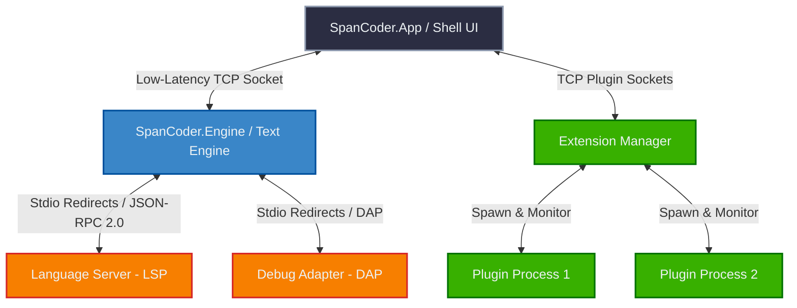
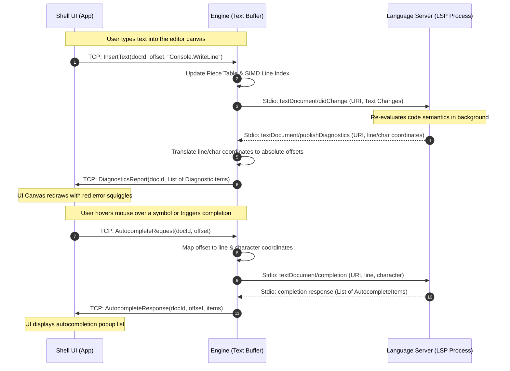
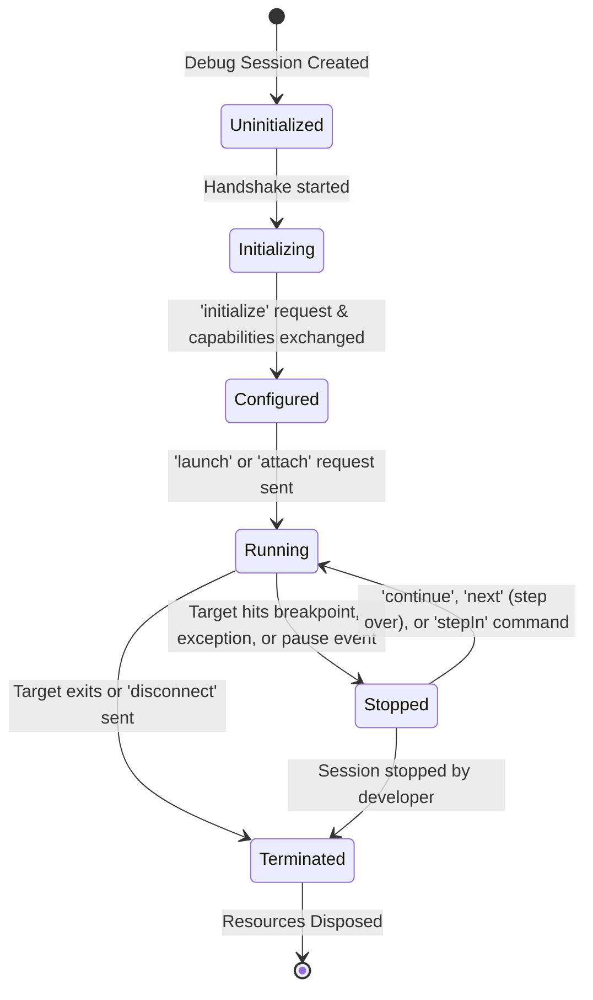
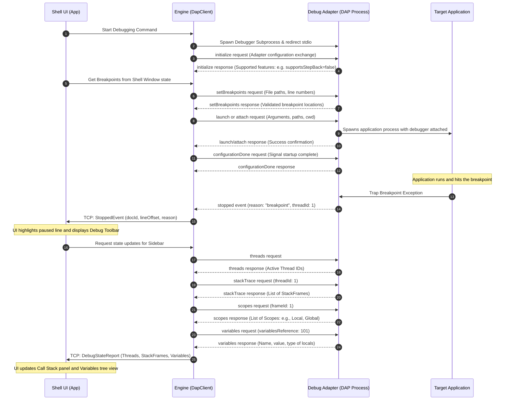

# SpanCoder IDE

SpanCoder is a cutting-edge, high-performance, extensibility-first Integrated Development Environment (IDE) built on **.NET 10** and **Avalonia UI**. Designed from the ground up for sub-millisecond startup, Native AOT compilation compatibility, and out-of-process resilience, SpanCoder aims to deliver a modern, premium experience for professional software developers.

Rather than relying on a traditional monolithic architecture where a heavy UI thread handles rendering, file buffer parsing, compiler services, and extensions, SpanCoder isolates critical subsystems into dedicated, decoupled processes. These processes communicate over low-latency binary-serialized TCP channels and standard stream-based redirects.

---

## Architectural Overview



### Decoupled Process Boundary Model

| Process | Primary Responsibility | Host Technologies | Threading & I/O Model |
| :--- | :--- | :--- | :--- |
| **SpanCoder.App (Shell UI)** | UI layout, input events, custom canvas rendering, window positioning, and layout orchestration. | Avalonia 11.1, .NET 10 | Single UI thread + multi-threaded command dispatch and TCP message reader loops. |
| **SpanCoder.Engine** | Piece-table text buffer representation, SIMD line indexing, syntax lexing, coordinates translations. | .NET 10 (AOT-compatible) | Single worker thread processing sequential buffer transactions via `System.Threading.Channels`. |
| **Extension Host Processes** | Executing third-party code, registering workspace items, creating custom sidebar panel content. | Language agnostic | Independent plugin runtimes communicating via JSON/binary socket interfaces. |
| **Language Server (LSP)** | Semantic syntax analysis, diagnostics, code completion list generation, hovers, and refactoring. | Node.js, .NET, Go, Rust, etc. | Spawned subprocess using standard I/O (stdin/stdout/stderr) redirection. |
| **Debug Adapter (DAP)** | Translating debugging UI commands into native debugger events (breakpoints, stepping, frame inspections). | Platform-specific engines | Spawned subprocess using standard I/O redirection. |

---

## Current Features (Implemented)

### 1. High-Performance Text Buffer Model
* **Piece Table Buffer** (`PieceTable.cs`): Represents document text modifications as a sequence of span descriptors pointing back to either the immutable original buffer or a thread-safe, pooled added-text character array (`ArrayPool<char>`). Edits (insertions and deletions) are $O(\text{edits})$ rather than $O(\text{document length})$, permitting instant operations on multi-gigabyte files.
* **Zero-Allocation Line Retrieval** (`Document.cs`): Line slicing checks if the requested segment lies contiguously in memory. If so, it yields a `ReadOnlySpan<char>` pointing directly to the underlying buffers without executing any heap allocations. For non-contiguous segments, a thread-local/rented buffer is used.

### 2. SIMD-Accelerated Line Indexing
* **Intrinsics Shifting** (`LineIndex.cs`): Maps absolute byte offsets to document line boundaries. On document edits, the starting offsets of all subsequent lines must shift by the net change length. SpanCoder accelerates this using hardware-accelerated SIMD instructions (`Vector<long>` from `System.Numerics`), processing line array adjustments in parallel blocks (up to 8 lines per instruction on AVX-512) instead of O(N) linear loops.

### 3. Out-of-Process Resiliency & Recovery
* **Active Replay Ledger** (`IpcEngineConnection.cs`): The UI Shell is isolated from the editing engine via a local TCP socket. In addition to processing edits, the App writes all edit transactions to an in-memory ledger.
* **Automatic Crash Recovery**: If `SpanCoder.Engine` crashes (e.g., due to out-of-memory or external process termination), the App immediately re-spawns a new engine instance, establishes the socket handshake, and replays the ledger in sequence to restore the editor state. The developer loses zero keystrokes and encounters no UI lockup.

### 4. Out-of-Process Extension Host
* **Extension Isolation** (`ExtensionManager.cs`): Third-party extensions run as separate processes, connecting to the App's plugin socket. Extensions register commands, keybindings, and panel descriptors using a standardized JSON manifest.
* **Resilient Commands**: Commands are executed asynchronously over the socket. If a plugin halts or enters an infinite loop, the primary IDE window remains fully active and responsive.

### 5. Compile-Time Command Routing
* **Zero-Reflection Dispatch** (`CommandGenerator.cs`): A custom incremental Source Generator processes any method or class annotated with `[Command]` or `[MenuItem]`. During compilation, it generates static dispatch branches mapping Command IDs to their execution pointers. This eliminates runtime reflection overhead, ensuring Native AOT trimmer safety and sub-millisecond IDE startup times.

### 6. Custom Rendered Canvas with Gutter
* **Overlay Gutter** (`TextEditorCanvas.cs`): Implements custom Skia-based text rendering in Avalonia. Features a stationary **Line Numbers Gutter** that acts as an overlay mask. When text is scrolled horizontally, it scrolls *under* the gutter.
* **Auto-Scrolling Viewport**: Automatically calculates viewport boundaries during cursor movement, scrolling the horizontal and vertical scrollbars to guarantee the caret remains visible (`EnsureCaretVisible()`).
* **Visual Carets**: Configurable caret thickness, drawing cursors using hardware-rendered animations.

### 7. Unified "Search Everywhere" Launcher
* **Premium Window-Anchored Overlay** (`CommandPalette.cs`): Located at the top center of the window, rendered with subtle drop shadows (`BoxShadows`) and a modern blurred backdrop.
* **Multi-Tab Mode**: Employs JetBrains-style tabs to switch contexts:
  * **All**: Merged results from files, commands, and active symbol declarations.
  * **Files**: Rapid file navigation.
  * **Actions**: Command execution with shortcuts.
  * **Symbols**: Local symbols parsing.
* **Workspace Background Indexing**: Traverses the workspace folder using background workers, building relative path caches to support instant keypress searching.
* **Local Symbols Parser**: Parses current document structures dynamically to locate namespaces, classes, methods, and variables.

### 8. Developer Language Extensions (LSP Client V1)
* **JSON-RPC Over Stdio** (`LspClient.cs`): Connects standard language servers by launching them as subprocesses and piping JSON-RPC payloads through their standard input and output streams.
* **Handshake Handlers**: Handles standard `initialize` capability negotiations.
* **Synchronization Protocols**: Automatically broadcasts document changes using incremental synchronization packets (`textDocument/didOpen` and `textDocument/didChange`).
* **Diagnostic Coordinate Translators** (`EngineHost.cs`): Translates standard LSP 0-indexed line/character coordinates into absolute document character offsets, passing `DiagnosticsReport` packets to the Shell to render inline squiggly underlines.
* **Interactive Requests**: Queries servers dynamically for Autocompletes (`textDocument/completion`), Hover Tooltips (`textDocument/hover`), and Semantic Code Navigation (`textDocument/definition`).

### 9. Multi-Format Solution and Project Workspace Integration
* **Visual Studio Solutions & Projects** (`SidebarFileTree.cs`): Native support for classic Visual Studio Solutions (`.sln`), modern Solution XML files (`.slnx`), and C# projects (`.csproj`).
* **Interactive Project Browsing**: The sidebar displays nested file and folder hierarchies matching the solution layout, allowing developers to add projects or folders directly and double-click to load any file into the editor viewport.
* **Directory Namespace Resolution**: Automatically computes namespace structures based on the target folder position relative to the `.csproj` file.

### 10. Out-of-Process Languages Extension Plugin
* **Resilient Extensibility** (`SpanCoder.Extensions.Languages`): Contributes rich language metadata (keywords, syntax coloring, line and block comment structures) and custom commands out-of-process.
* **Dynamic Sidebar Toolbar Contribution**: Seamlessly registers and mounts buttons onto the Shell UI's workspace toolbar, communicating exclusively via structured JSON-RPC packets over low-latency socket buffers.

---

## Architectural Deep Dive: Developer Language Extensions

SpanCoder uses the Language Server Protocol (LSP) to support syntax analysis, code completion, error diagnostics, and source navigation.

### Extension Registration Manifest (`plugin.json`)

To contribute language support, an extension provides a manifest defining activation triggers and the server launch command:

```json
{
  "id": "csharp-lang-support",
  "displayName": "C# Development Kit",
  "version": "1.0.0",
  "activationEvents": [
    "onLanguage:csharp"
  ],
  "contributes": {
    "languages": [
      {
        "id": "csharp",
        "extensions": [".cs", ".csx"]
      }
    ],
    "lsp": {
      "command": "csharp-ls",
      "args": ["--stdio"],
      "initializationOptions": {
        "solution": "${workspaceFolder}"
      }
    }
  }
}
```

### LSP Communication and Coordinate Mapping Lifecycle

The following sequence highlights how the UI Shell, Text Engine, and Language Server subprocess synchronize text and request services:



---

## Architectural Deep Dive: Interactive Debugging

SpanCoder implements debugging support using the **Debug Adapter Protocol (DAP)**. DAP decouples the IDE UI from specific debuggers (e.g. LLDB, GDB, Node-Debug, .NET CoreCLR Debugger) by defining standard JSON-RPC messages to control process execution, read memory, and handle breakpoints.

### Debug Session State Machine

A debugger session proceeds through the following lifecycle states:



### DAP Protocol Message Flow Sequence

When a developer sets breakpoints and launches a debugger, the following communication takes place:



### Debug Launch Configuration (`launch.json`)

Workspace launch behaviors are declared inside a `.spancoder/launch.json` file in the root workspace folder:

```json
{
  "version": "0.2.0",
  "configurations": [
    {
      "name": ".NET Core Launch (Console)",
      "type": "coreclr",
      "request": "launch",
      "program": "${workspaceFolder}/bin/Debug/net10.0/MyApp.dll",
      "args": ["--verbose", "input.txt"],
      "cwd": "${workspaceFolder}",
      "stopAtEntry": false,
      "env": {
        "ASPNETCORE_ENVIRONMENT": "Development"
      }
    },
    {
      "name": "Attach to Local Python Process",
      "type": "python",
      "request": "attach",
      "connect": {
        "host": "localhost",
        "port": 5678
      },
      "pathMappings": [
        {
          "localRoot": "${workspaceFolder}",
          "remoteRoot": "/app"
        }
      ]
    }
  ]
}
```

### Debugger UI Panels & Shell Layout Integration

Interactive debugging features are integrated into the main shell via several dedicated UI components:

```
+-----------------------------------+-----------------------------------------+
| [Menu: File  Edit  Debug]         | [Floating Debug Toolbar: |> || || ->]   |
+-----------------+-----------------+-----------------------------------------+
| [Sidebar Tab]   | [File Explorer] | TextEditorCanvas.cs                     |
|                 |                 |                                         |
| [X] Debug       | MyApp.cs        | 10  using System;                       |
|   - Variables   |                 | 11  class Program {                     |
|     - args: []  |                 | 12    static void Main() {              |
|     > locals:   |                 | 13*==>   Console.WriteLine("Debug");    |
|                 |                 | 14    }                                 |
|   - Call Stack  |                 | 15  }                                   |
|     - Main()    |                 |                                         |
|                 |                 |                                         |
|   - Breakpoints |                 |                                         |
|     [x] 13: MyApp |                 |                                         |
+-----------------+-----------------+-----------------------------------------+
```

1. **Floating Debug Toolbar**: An overlay control positioned at the top of the editor canvas:
   * **Start / Continue (F5)**: Begins execution or resumes a paused thread.
   * **Step Over (F10)**: Executes the current line of code and stops at the next line in the same file.
   * **Step Into (F11)**: Steps inside function definitions.
   * **Step Out (Shift + F11)**: Executes remainder of current function, returning to the caller.
   * **Stop / Terminate (Shift + F5)**: Disconnects the debugger and kills the target process.
   * **Restart (Ctrl + Shift + F5)**: Rebuilds and re-launches the application under the debugger.
2. **Interactive Editor Gutter**:
   * Clicking in the gutter area left of the line numbers creates a **Breakpoint Marker** (visualized as a red dot).
   * Right-clicking a breakpoint marker displays an input box to set **Conditional Breakpoints** (e.g. `count > 10`) or **Hit Counts**.
3. **Debug Side Panels (Sidebar Layout)**:
   * **Call Stack View**: Displays active threads. Expanding a thread lists stack frames. Clicking a frame loads that frame's source file and positions the caret on the active line.
   * **Variables Tree View**: Displays a hierarchical tree of variables in the selected frame scope. Handles nested objects and arrays using lazy evaluation.
   * **Breakpoints Registry**: Displays a list of all breakpoints. Permits quick enabling, disabling, or batch deleting of targets.
4. **Inline Diagnostics & Hover Inspection**:
   * During stopped states, hovering the mouse cursor over a variable queries DAP for its current evaluation and displays the value inline as a premium dark-themed tooltip.
   * Execution indicators show the active instruction pointer using a highlighted background line and an arrow icon.

---

## Phased Improvement Roadmap

### Phase 1: Core Performance and Polish (Focus: WOW UX & Layouts)
* [x] **Stationary Line Numbers Gutter**: Renders a stationary sidebar gutter that prevents text scrolling under the gutter area.
* [x] **Caret Auto-Scroll Viewport**: Forces viewport scrolling when navigating via keyboard so the caret remains visible.
* [x] **Premium Command Palette Overlay**: Creates a centered, blurred dropdown supporting workspace file matching and command dispatch.
* [x] **Built-in Language Highlighters**: Implemented Native AOT-friendly, zero-allocation core syntax highlighting for JSON, HTML, JavaScript, CSS, and Markdown.

### Phase 2: Production-grade LSP client & Grep Workspace Search
* [x] **Stdio Executable Integrations**: Upgrade the `LspClient` to dynamically spawn real command-line LSPs (like `csharp-ls` or `pyright`) based on file extensions.
* [x] **Comprehensive Semantic Routing**: Route "Goto Definition" (F12) [x], "Find References" (Shift+F12) [x], "Rename" (F2) [x], and "Document Symbols" [x] from the LSP process down to the UI.
* [x] **Grep Workspace Integration**: Reference the sibling **[Glacier.Grep](../Glacier.Grep)** engine in `SpanCoder.Engine` to execute regex searches across all workspace documents in sub-milliseconds, bypassing UI thread overhead.

### Phase 3: Interactive Debugging (DAP Integration)
* [x] **DAP Engine Client**: Develop a standard-compliant `DapClient` in `SpanCoder.Engine` to interface with debug engines like `netcoredbg` (.NET) or `lldb-vscode` (C++/Rust).
* [x] **Debug Toolbar UI**: Create a floating, transparent overlay toolbar in the `ShellWindow`.
* [x] **Gutter Breakpoint Hooks**: Update `TextEditorCanvas` mouse click events to detect gutter coordinates, toggling breakpoints.
* [x] **Sidebar Tree Controls**: Add interactive sidebar panes for call stacks, threads, scopes, variables, and breakpoints list.

### Phase 4: Resilient Embedded Terminal & Version Control
* [x] **PTY Terminal Emulator**: Build a native cross-platform terminal control in `SpanCoder.Shell` that handles standard PTY streams (ConPTY on Windows, `/dev/ptmx` on macOS/Linux), rendering shell output in a terminal pane.
* [x] **Git Version Control Provider**: Launch a background worker to query `git status` and highlight modified lines (added, edited, deleted) directly inside the editor gutter margin.
* [x] **Source Control Pane**: Build a staging and commit sidebar, allowing staging of files, writing commit messages, and pushing branches.

### Phase 5: NuGet Extension SDK & Marketplace Ecosystem
* [x] **Contracts Assembly Extraction**: Publish `SpanCoder.Contracts` to NuGet to allow developers to write language or command extensions in separate projects.
* [x] **Sandbox Plugin Launcher**: Spawn extensions inside a sandboxed environment, allowing them to access the editor state only through well-defined JSON-RPC protocols.
* [x] **Extension Marketplace**: Build an extension browser panel in the IDE sidebar to search, install, and hot-reload plugins dynamically.
* [x] **Out-of-Process Language Extensions**: Support system/backend language packs (C++, Rust, Go, Python) as external plugins communicating over JSON-RPC sockets.

---

## Build, Run, and Test Instructions

### Prerequisites
* **.NET 10.0 SDK** (Preview or Release matching project specifications)

### Compilation
Build the solution files using the .NET CLI:
```bash
dotnet build SpanCoder.slnx
```

### Execution
Run the primary UI application process:
```bash
dotnet run --project src/SpanCoder.App/SpanCoder.App.csproj
```

### Running Tests
Execute the xUnit tests suite:
```bash
dotnet test
```

### Native AOT Compilation (AOT Publish)
To compile a single, zero-dependency executable file with sub-millisecond cold start times, run:
```bash
dotnet publish src/SpanCoder.App/SpanCoder.App.csproj -c Release -r win-x64 --self-contained -p:PublishAot=true -p:OptimizationPreference=Speed -p:TrimMode=link
```
This produces a fully compiled native binary in the publish folder, ready for distribution.

---

> [!IMPORTANT]
> **Extensibility Core Promise**: Every component inside SpanCoder is designed to communicate via messages, ensuring no shared memory exists between plugins, debuggers, or the main application thread. This ensures the IDE remains operational even when external language services or debugger sessions encounter severe errors.
